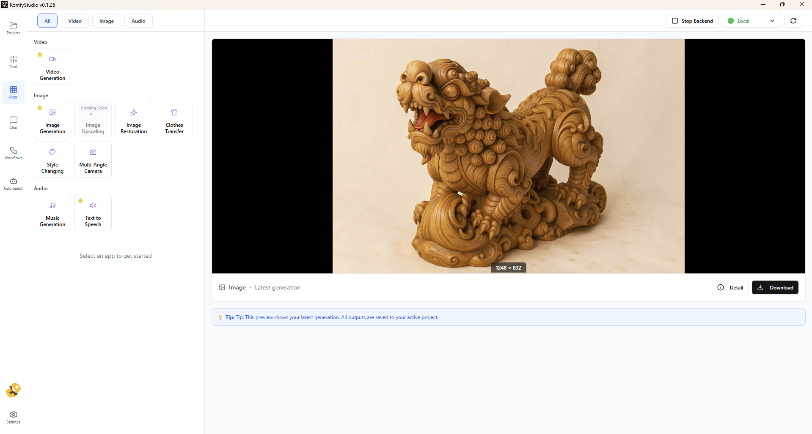

# 🎨 KomfyStudio

**Ứng dụng tạo ảnh & video AI được hỗ trợ bởi ComfyUI**

🇻🇳 Tiếng Việt | <a href="./README.en.md" target="_blank">🇬🇧 English</a>

---

## 📥 Tải Xuống

**<a href="https://github.com/tuyenhm68/KomfyStudio/releases/latest" target="_blank">⬇️ Tải phiên bản mới nhất</a>**

**<a href="https://drive.google.com/file/d/1De-0ZK_Igly5iFKwfKAUd4V6Vj87XDl4/view?usp=drive_link" target="_blank">⬇️ Comfy Portable dành cho KomfyStudio</a>**

**<a href="https://modal.com/notebooks/tuyenhm68/main/nb-DbCzbt5HUwPCz49YjN1W94" target="_blank">⬇️ Comfy Modal Notebook dành cho KomfyStudio</a>**

****

**<a href="https://console.runpod.io/deploy?template=c2clojkox5&ref=rpuub8vb" target="_blank">⬇️ Comfy Runpod serverless template dành cho KomfyStudio</a>**

### Yêu Cầu Hệ Thống

- **Hệ điều hành**: Windows 10/11
- **RAM**: Tối thiểu 12GB (Khuyến nghị 32GB+)
- **GPU**: NVIDIA GPU với CUDA support từ 12GB VRAM trở lên (Khuyến nghị 24GB+ VRAM)
- **Dung lượng ổ cứng**: 
- 200MB dung lượng trống để cài app
- 100GB+ dung lượng trống để cài ComfyUI (Khuyến nghị ổ SSD 500GB trở lên)

### Hướng Dẫn
**<a href="https://www.youtube.com/playlist?list=PL9QrPbhu7dy_iW_QMaWAlyWKEoXncJnYp" target="_blank">Video Hướng dẫn cài đặt và sử dụng</a>**
---

## ✨ Tính Năng Chính

### 🖼️ Tạo Ảnh AI

- **Text-to-Image (T2I)**: Tạo ảnh từ mô tả văn bản
- **Image-to-Image (I2I)**: Chỉnh sửa và biến đổi ảnh
- **Photo Restore**: Phục hồi và nâng cao chất lượng ảnh cũ
- **Clothes Transfer**: Chuyển quần áo giữa các ảnh
  - Trích xuất quần áo từ ảnh tham chiếu
  - Chuyển quần áo sang nhân vật khác
  - Hỗ trợ 2 chế độ: Extract + Transfer hoặc Transfer trực tiếp
- **Multi-Angle Camera**: Tạo ảnh từ nhiều góc nhìn 3D
  - Điều khiển góc camera bằng giao diện 3D trực quan
  - Xem trước góc nhìn real-time với mô hình 3D
  - Tự động tạo prompt dựa trên góc camera
  - Hỗ trợ model Flux2-Klein 9B
- **Style Changing**: Chuyển đổi phong cách ảnh
  - Nhiều preset phong cách: Anime, Sketch, Lego, Ghibli, v.v.
  - Tùy chỉnh prompt để tạo phong cách riêng
- Hỗ trợ nhiều định dạng: Landscape, Square, Portrait

### 🎬 Tạo Video AI

- **Text-to-Video (T2V)**: Tạo video từ mô tả văn bản
- **Image-to-Video (I2V)**: Chuyển ảnh tĩnh thành video động
- Hỗ trợ nhiều tỷ lệ khung hình

### 🎵 Tạo Âm Thanh AI

- **Text-to-Audio**: Tạo âm thanh và nhạc từ mô tả
- **Text-to-Music**: Tạo nhạc từ mô tả

### 🏪 App Store

- **Kho ứng dụng cộng đồng**: Tải và cài đặt apps do cộng đồng chia sẻ
- **Cài đặt một chạm**: Tự động tải và cài đặt models, custom nodes
- **Quản lý phiên bản**: Kiểm tra và cập nhật apps đã cài đặt
- **Đánh giá và nhận xét**: Xem đánh giá từ người dùng khác
- **Tìm kiếm và lọc**: Dễ dàng tìm apps theo danh mục, tác giả
- **Chi tiết đầy đủ**: Xem thông tin models, nodes, dependencies trước khi cài

**<a href="./docs/user-guide/app-store-guide.md" target="_blank">📖 Xem hướng dẫn chi tiết App Store</a>**

### 🛠️ App Builder

- **Tạo app không cần code**: Chuyển ComfyUI workflow thành app hoàn chỉnh
- **Wizard 5 bước**: Hướng dẫn từng bước tạo app
  1. Upload workflow JSON
  2. Cấu hình metadata (tên, mô tả, icon, category)
  3. Thiết kế giao diện với drag-and-drop
  4. Liên kết controls với workflow parameters
  5. Xem trước và xuất bản
- **Tự động phát hiện**: Phân tích workflow, tìm models và custom nodes cần thiết
- **Thiết kế UI linh hoạt**: Kéo thả controls, tùy chỉnh layout
- **Chia sẻ lên Store**: Xuất bản app để cộng đồng sử dụng
- **Quản lý phiên bản**: Cập nhật và duy trì apps của bạn

**<a href="./docs/user-guide/app-builder-guide.md" target="_blank">📖 Xem hướng dẫn chi tiết App Builder</a>**

### 🔧 Quản Lý Backend

- **Local Backend**: Chạy ComfyUI trên máy tính của bạn
  - Nút Start/Stop backend tiện lợi
  - Cấu hình đường dẫn tùy chỉnh
- **VPS Backend**: Kết nối đến server từ xa sử dụng: VPS, Colab, Runpod
- **Serverless Backend**: Sử dụng RunPod Serverless
- Chuyển đổi backend linh hoạt
- Kiểm tra trạng thái kết nối

### 📁 Quản Lý Dự Án

- Tổ chức outputs theo dự án
- Xem lịch sử tạo ảnh/video
- Tìm kiếm và lọc nhanh
- Xóa hàng loạt
- So sánh ảnh trước/sau (Photo Restore)

### 🎨 Giao Diện Thân Thiện

- Giao diện hiện đại, dễ sử dụng
- Hỗ trợ Tiếng Việt, English
- Preview real-time khi tạo
- Zoom và pan ảnh trong modal preview

### 🔄 Tự Động Cập Nhật

- Kiểm tra cập nhật tự động
- Tải và cài đặt phiên bản mới
- Thông báo khi có bản cập nhật

---

## 🚀 Cài Đặt

### Bước 1: Tải Installer

1. Vào <a href="https://github.com/tuyenhm68/KomfyStudio/releases/latest" target="_blank">Releases</a>, tải file `KomfyStudio-Setup-x.x.x.exe`
2. Tải ComfyUI Portable <a href="https://bit.ly/4rdBPOM" target="_blank">(Theo link)</a>

### Bước 2: Cài Đặt

1. Chạy file installer đã tải
2. Làm theo hướng dẫn trên màn hình
3. Hoàn tất cài đặt

### Bước 3: Cấu Hình Backend (Tùy chọn)

#### Sử dụng Local Backend

1. Mở **Settings** → **Backend**
2. Chọn backend **Local**
3. Click **Browse** để chọn thư mục ComfyUI của bạn
   - Ví dụ: `E:\ComfyUI_windows_portable`
4. Click **Save**
5. Click **Start Backend** để khởi động ComfyUI
6. Đợi backend kết nối (trạng thái chuyển sang "Connected")

#### Sử dụng VPS Backend

1. Mở **Settings** → **Backend**
2. Click **Add Backend**
3. Chọn type: **VPS**
4. Nhập thông tin:
   - Name: Tên backend (ví dụ: "My VPS")
   - URL: Địa chỉ server (ví dụ: `http://192.168.1.100:8188`)
5. Click **Add**
6. Click **Test Connection** để kiểm tra

---

## 📖 Hướng Dẫn Sử Dụng

### Tạo Ảnh từ Text (T2I)

1. Chọn tab **Tools** → **Image**
2. Chọn app **Text to Image**
3. Nhập prompt mô tả ảnh bạn muốn
4. Chọn kích thước và số lượng ảnh
5. Click **Generate**
6. Xem kết quả trong panel **Preview**
7. Click **Download** để tải ảnh về

### Tạo Video từ Ảnh (I2V)

1. Chọn tab **Tools** → **Video**
2. Chọn app **Image to Video**
3. Upload ảnh nguồn
4. Nhập prompt mô tả chuyển động
5. Chọn thời lượng video
6. Click **Generate**
7. Xem video trong panel **Preview**

### Phục Hồi Ảnh Cũ (Photo Restore)

1. Chọn tab **Tools** → **Image**
2. Chọn app **Photo Restore**
3. Upload ảnh cần phục hồi
4. Nhập prompt mô tả (tùy chọn)
5. Click **Generate**
6. Xem kết quả so sánh trước/sau
7. Click **Compare** để xem chi tiết

### Chuyển Quần Áo (Clothes Transfer)

**Chế độ 1: Trích xuất + Chuyển (Extract + Transfer)**

1. Chọn tab **Apps** → **Image**
2. Chọn app **Clothes Transfer**
3. Upload **ảnh nhân vật chính** (Input 1) - người sẽ mặc quần áo mới
4. Upload **ảnh tham chiếu** (Input 2) - người đang mặc quần áo bạn muốn
5. Click **Generate**
6. Hệ thống sẽ tự động:
   - Trích xuất quần áo từ ảnh tham chiếu
   - Chuyển quần áo sang nhân vật chính
7. Xem kết quả trong panel **Preview**

**Chế độ 2: Chuyển trực tiếp (Direct Transfer)**

1. Chọn tab **Apps** → **Image**
2. Chọn app **Clothes Transfer**
3. Upload **ảnh nhân vật chính** (Input 1)
4. Upload **ảnh quần áo đã trích xuất** (Input 3) - chỉ có quần áo, không có người
5. Click **Generate**
6. Xem kết quả trong panel **Preview**

**💡 Lưu ý:**
- Input 2 (ảnh tham chiếu) và Input 3 (quần áo đã trích xuất) **loại trừ lẫn nhau**
- Chỉ upload 1 trong 2: hoặc Input 2 hoặc Input 3
- Kết quả tự động lưu vào dự án đang active
- App tự động lưu cache để bạn có thể quay lại tiếp tục
- Hỗ trợ định dạng: PNG, JPG, WebP

### Tạo Ảnh Đa Góc Nhìn (Multi-Angle Camera)

1. Chọn tab **Apps** → **Image**
2. Chọn app **Multi-Angle Camera**
3. Upload **ảnh nhân vật** - ảnh gốc bạn muốn tạo lại từ góc khác
4. Sử dụng **giao diện 3D** để điều chỉnh góc camera:
   - **Kéo chuột trái**: Xoay camera quanh đối tượng
   - **Cuộn chuột**: Zoom in/out
   - **Nút Reset**: Đặt lại góc camera về mặc định
5. Xem **thông tin góc camera** real-time:
   - Azimuth (góc ngang): -180° đến 180°
   - Polar (góc dọc): 0° đến 180°
   - Zoom: Khoảng cách camera
6. Prompt sẽ **tự động cập nhật** dựa trên góc camera bạn chọn
7. Click **Generate** để tạo ảnh
8. Xem kết quả trong panel **Preview**

**💡 Lưu ý:**
- Model Flux2-Klein 9B cần ~12GB VRAM
- Góc camera càng khác biệt, kết quả càng sáng tạo
- Có thể chỉnh sửa prompt tự động để tinh chỉnh kết quả
- Kết quả tự động lưu vào dự án đang active

### Quản Lý Dự Án

1. Chọn tab **Projects**
2. Click **New Project** để tạo dự án mới
3. Tất cả outputs sẽ được lưu vào dự án đang active
4. Click vào dự án để xem tất cả outputs
5. Sử dụng tìm kiếm để lọc outputs

---

## 🔧 Cài Đặt Nâng Cao

### Cấu Hình API Keys

1. Mở **Settings** → **General**
2. Nhập Hugging Face token để phục vụ tải các models có giới hạn truy cập

---

## ❓ Câu Hỏi Thường Gặp

### App không kết nối được với backend?

**Giải pháp**:
1. Kiểm tra ComfyUI đã được cài đặt chưa
2. Kiểm tra đường dẫn ComfyUI trong Settings đúng chưa
3. Click **Start Backend** để khởi động
4. Đợi 10-30 giây để backend khởi động
5. Click **Test Connection** để kiểm tra

### Tạo ảnh/video bị lỗi?

**Giải pháp**:
1. Kiểm tra backend đang kết nối (trạng thái "Connected")
2. Kiểm tra models cần thiết đã được cài đặt
3. Kiểm tra custom nodes đã được cài đặt
4. Xem logs trong console để biết lỗi cụ thể

### Làm sao để cập nhật app?

**Tự động**:
- App sẽ tự động kiểm tra cập nhật khi khởi động
- Thông báo sẽ hiện khi có phiên bản mới
- Click **Download Update** để tải và cài đặt

**Thủ công**:
1. Vào <a href="https://github.com/tuyenhm68/KomfyStudio/releases/latest" target="_blank">Releases</a>
2. Tải installer mới nhất
3. Chạy installer để cập nhật

### Làm sao để gỡ cài đặt?

1. Vào **Settings** → **Apps & Features** (Windows)
2. Tìm "KomfyStudio"
3. Click **Uninstall**
4. Làm theo hướng dẫn

---

## 🐛 Báo Lỗi & Góp Ý

Nếu bạn gặp lỗi hoặc có góp ý:

1. Mở app → **Settings** → **Feedback**
2. Chọn loại feedback:
   - 🐛 Bug Report (Báo lỗi)
   - ✨ Feature Request (Yêu cầu tính năng)
   - 💡 Suggestion (Đề xuất)
3. Điền thông tin chi tiết
4. Đính kèm ảnh chụp màn hình (nếu có)
5. Click **Send Feedback**

---

## 📄 Giấy Phép

Copyright © 2026 Hà Mạnh Tuyến

---

## 🔗 Liên Kết
- **YouTube**: <a href="https://youtube.com/@tuyenhm68" target="_blank">Kênh YouTube</a>
---