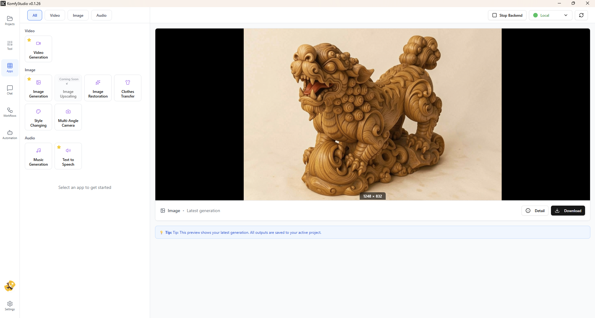

# 🎨 KomfyStudio

**AI Image & Video Generation App powered by ComfyUI**

<a href="./README.vi.md" target="_blank">🇻🇳 Tiếng Việt</a> | 🇬🇧 English

---

## 📥 Download

**<a href="https://github.com/tuyenhm68/KomfyStudio/releases/latest" target="_blank">⬇️ Download Latest Version</a>**

**<a href="https://drive.google.com/file/d/1e105-dN0neUjymGfpqS5wf3Om-yFASy5/view?usp=sharing" target="_blank">⬇️ ComfyUI Portable for KomfyStudio</a>**

**<a href="https://modal.com/notebooks/tuyenhm68/main/nb-DbCzbt5HUwPCz49YjN1W94" target="_blank">⬇️ ComfyUI Modal Notebook for KomfyStudio</a>**

****

**<a href="https://console.runpod.io/deploy?template=c2clojkox5&ref=rpuub8vb" target="_blank">⬇️ ComfyUI Runpod Serverless Template for KomfyStudio</a>**

### System Requirements

- **OS**: Windows 10/11
- **RAM**: Minimum 12GB (Recommended 32GB+)
- **GPU**: NVIDIA GPU with CUDA support, 12GB+ VRAM (Recommended 24GB+ VRAM)
  > ⚠️ **Note:** NVIDIA GPU is only required when using the **ComfyUI** backend (Local/VPS/Serverless). If you only use the **Workflow Builder** to generate images/videos via **Google Gemini API** or **Google Flows**, **no NVIDIA GPU is needed** — the app can run on any computer.
- **Storage**: 
  - 200MB for app installation
  - 100GB+ for ComfyUI installation (Recommended 500GB+ SSD) — *only required when using ComfyUI backend*

### Tutorials
**<a href="https://www.youtube.com/playlist?list=PL9QrPbhu7dy_iW_QMaWAlyWKEoXncJnYp" target="_blank">Video Tutorials (Installation & Usage)</a>**

---

## ✨ Key Features

### 🖼️ AI Image Generation

- **Text-to-Image (T2I)**: Generate images from text descriptions
- **Image-to-Image (I2I)**: Edit and transform images
- **Photo Restore**: Restore and enhance old photos
- **Clothes Transfer**: Transfer clothing between images
  - Extract clothing from reference image
  - Transfer clothing to another character
  - Support 2 modes: Extract + Transfer or Direct Transfer
- **Multi-Angle Camera**: Generate images from multiple 3D viewpoints
  - Control camera angle with intuitive 3D interface
  - Real-time preview with 3D model
  - Auto-generate prompts based on camera angle
  - Support Flux2-Klein 9B model
- **Style Changing**: Transform image styles
  - Multiple style presets: Anime, Sketch, Lego, Ghibli, etc.
  - Customize prompts for unique styles
- Support multiple formats: Landscape, Square, Portrait

### 🎬 AI Video Generation

- **Text-to-Video (T2V)**: Generate videos from text descriptions
- **Image-to-Video (I2V)**: Convert static images to dynamic videos
- **MiniMax H3** ⭐ — All-in-One AI video generation running 100% locally (GPU ≥ 24GB VRAM)
  - **T2V**: Text to Video (with native audio)
  - **I2V**: Image to Video — animate from first/last frame
  - **R2V**: Reference to Video — image = identity, video = motion, audio = soundtrack
  - **Audio Drive**: Automatic lip-sync from audio
  - **Keyframes**: Morph through specified keyframe images
  - **Extend**: Extend video by a few more seconds
  - **Chain**: Multi-clip continuous video with motion continuity
  - **Music**: AI music generation from caption/lyrics (MiniMax Music 3)
  - **Upscale**: Upscale video resolution
- Support multiple aspect ratios

**<a href="./docs/user-guide/minimax-h3-guide.en.md" target="_blank">📖 See detailed MiniMax H3 Guide</a>**

### 💬 Chat

- **Describe it and it runs**: Type what you want to create — no app to open, no workflow to wire
- **Automatic routing**: Attachments decide the mode (1 image → I2V, 1 audio → Audio Drive, 1 video → Extend)
- **Switch models inline**: MiniMax H3, LTX 2.5, WAN 2.2 for video, MiniMax Music 3 for music, plus your installed image workflows
- **Plan preview**: A summary line states exactly what will run before you send
- **Project gallery**: Every result from Chat and apps in one place, grouped by day and filterable
- **Reuse results**: Feed a previous result back in as input, or rerun the same prompt as a variant
- **Background jobs**: Switching conversations never cancels a running job

**<a href="./docs/user-guide/chat-guide.en.md" target="_blank">📖 View detailed Chat guide</a>**

### 🧩 Skill

- **Type `/` anywhere**: Skills work in every prompt box of every app, not just Chat
- **Three kinds**: Template (offline), LLM (writes the prompt for you), Multi-step (asks, generates, waits for approval, then generates video)
- **Accent-insensitive search**: Typing `giay` still finds `giấy`
- **Runs survive restarts**: A skill waiting on your answer is restored intact
- **Skill Hub**: Install from the community library, or publish your own
- **Import / export**: Package skills to a file to share or back up

**<a href="./docs/user-guide/skill-guide.en.md" target="_blank">📖 View detailed Skill guide</a>**

### 🎵 AI Audio Generation

- **Text-to-Audio**: Generate sound and music from descriptions
- **Text-to-Music**: Generate music from descriptions

### 🏪 App Store

- **Community app marketplace**: Download and install apps shared by the community
- **One-click installation**: Automatically download and install models, custom nodes
- **Version management**: Check and update installed apps
- **Ratings and reviews**: View ratings from other users
- **Search and filter**: Easily find apps by category, author
- **Full details**: View models, nodes, dependencies info before installing

**<a href="./docs/user-guide/app-store-guide.en.md" target="_blank">📖 View detailed App Store guide</a>**

### 🛠️ App Builder

- **Create apps without code**: Transform ComfyUI workflows into complete apps
- **5-step wizard**: Step-by-step guidance for app creation
  1. Upload workflow JSON
  2. Configure metadata (name, description, icon, category)
  3. Design interface with drag-and-drop
  4. Link controls to workflow parameters
  5. Preview and publish
- **Auto-detection**: Analyze workflow, find required models and custom nodes
- **Flexible UI design**: Drag-drop controls, customize layout
- **Share to Store**: Publish apps for community use
- **Version management**: Update and maintain your apps

**<a href="./docs/user-guide/app-builder-guide.en.md" target="_blank">📖 View detailed App Builder guide</a>**

### 🔗 Workflow Builder

- **Visual workflow editor**: Build AI pipelines with drag-and-drop nodes
- **Diverse node types**: Text, Image, Video, Audio Input/Output & AI Model nodes
- **Smart connections**: Only allows compatible data port connections
- **Built-in templates**: Quick start with popular workflow templates
- **Community templates**: Discover and use workflows shared by the community
  - Open community workflows in **Read-Only** mode
  - Click **Make a Copy** to create an editable version
- **Publish and share**: Publish workflows to the community
  - Update published workflows
  - Unpublish when needed
- **Asset management**: Upload and manage images, files used in workflows
- **Run directly**: Execute workflows within the app using Google Gemini API
- **Cost tracking**: Display real-time session cost

### 🔧 Backend Management

- **Local Backend**: Run ComfyUI on your computer
  - Convenient Start/Stop backend button
  - Custom path configuration
- **VPS Backend**: Connect to remote servers using: VPS, Colab, Runpod
- **Serverless Backend**: Use RunPod Serverless
- Flexible backend switching
- Connection status checking

### 📁 Project Management

- Organize outputs by project
- View image/video generation history
- Quick search and filter
- Bulk delete
- Before/After comparison (Photo Restore)

### 🎨 User-Friendly Interface

- Modern, easy-to-use interface
- Support Vietnamese, English
- Real-time preview during generation
- Zoom and pan images in preview modal

### 🔄 Auto Update

- Automatic update checking
- Download and install new versions
- Notifications for updates

---

## 🔌 Komfy Bridge — Chrome Extension

> A Chrome Extension that connects Komfy Studio to **Google Flow**, enabling AI video generation with **Google's Veo 3.1** model directly in the Workflow Builder — no API key required.

### Installation

Extension is **auto-installed** from version v0.1.39 onwards:

1. Open **Settings** → **Extension** tab → click **Install Now** (or auto-installs on startup)
2. Copy the displayed extension path
3. Open Chrome → `chrome://extensions` → enable **Developer mode** → **Load unpacked** → paste the path

### How to use

1. Open **Komfy Studio** (must be running) + open Chrome → go to <a href="https://labs.google/fx/tools/flow" target="_blank">Google Flow</a> → sign in
2. **Connected** status appears in Settings → Extension
3. In Workflow Builder, add a **Veo 3.1** node → enable **"Use Google Flow"** → click Run

**<a href="./docs/user-guide/chrome-extension-guide.en.md" target="_blank">📖 View full guide</a>** | **<a href="https://github.com/tuyenhm68/komfy-extension/releases" target="_blank">📦 GitHub Releases</a>**

---

## 🚀 Installation

### Step 1: Download Installer

1. Go to <a href="https://github.com/tuyenhm68/KomfyStudio/releases/latest" target="_blank">Releases</a>, download `KomfyStudio-Setup-x.x.x.exe`
2. Download ComfyUI Portable <a href="https://bit.ly/4rdBPOM" target="_blank">(Link)</a>

### Step 2: Install

1. Run the downloaded installer
2. Follow on-screen instructions
3. Complete installation

### Step 3: Configure Backend (Optional)

#### Using Local Backend

1. Open **Settings** → **Backend**
2. Select **Local** backend
3. Click **Browse** to select your ComfyUI folder
   - Example: `E:\ComfyUI_windows_portable`
4. Click **Save**
5. Click **Start Backend** to start ComfyUI
6. Wait for backend to connect (status changes to "Connected")

#### Using VPS Backend

1. Open **Settings** → **Backend**
2. Click **Add Backend**
3. Select type: **VPS**
4. Enter information:
   - Name: Backend name (e.g., "My VPS")
   - URL: Server address (e.g., `http://192.168.1.100:8188`)
5. Click **Add**
6. Click **Test Connection** to verify

---

## 📖 Usage Guide

### Generate Image from Text (T2I)

1. Select **Tools** tab → **Image**
2. Select **Text to Image** app
3. Enter prompt describing the image you want
4. Select size and number of images
5. Click **Generate**
6. View results in **Preview** panel
7. Click **Download** to save image

### Generate Video from Image (I2V)

1. Select **Tools** tab → **Video**
2. Select **Image to Video** app
3. Upload source image
4. Enter prompt describing motion
5. Select video duration
6. Click **Generate**
7. View video in **Preview** panel

### Restore Old Photos (Photo Restore)

1. Select **Tools** tab → **Image**
2. Select **Photo Restore** app
3. Upload photo to restore
4. Enter prompt description (optional)
5. Click **Generate**
6. View before/after comparison
7. Click **Compare** for details

### Transfer Clothing (Clothes Transfer)

**Mode 1: Extract + Transfer**

1. Select **Apps** tab → **Image**
2. Select **Clothes Transfer** app
3. Upload **main character image** (Input 1) - person who will wear new clothes
4. Upload **reference image** (Input 2) - person wearing clothes you want
5. Click **Generate**
6. System will automatically:
   - Extract clothing from reference image
   - Transfer clothing to main character
7. View results in **Preview** panel

**Mode 2: Direct Transfer**

1. Select **Apps** tab → **Image**
2. Select **Clothes Transfer** app
3. Upload **main character image** (Input 1)
4. Upload **extracted clothing image** (Input 3) - only clothing, no person
5. Click **Generate**
6. View results in **Preview** panel

**💡 Notes:**
- Input 2 (reference image) and Input 3 (extracted clothing) are **mutually exclusive**
- Only upload one: either Input 2 or Input 3
- Results automatically saved to active project
- App auto-saves cache so you can continue later
- Supported formats: PNG, JPG, WebP

### Multi-Angle Camera

1. Select **Apps** tab → **Image**
2. Select **Multi-Angle Camera** app
3. Upload **character image** - original image you want to recreate from different angle
4. Use **3D interface** to adjust camera angle:
   - **Left mouse drag**: Rotate camera around object
   - **Mouse wheel**: Zoom in/out
   - **Reset button**: Reset camera to default
5. View **camera angle information** in real-time:
   - Azimuth (horizontal angle): -180° to 180°
   - Polar (vertical angle): 0° to 180°
   - Zoom: Camera distance
6. Prompt will **auto-update** based on selected camera angle
7. Click **Generate** to create image
8. View results in **Preview** panel

**💡 Notes:**
- Flux2-Klein 9B model requires ~12GB VRAM
- More different camera angles create more creative results
- Can edit auto-generated prompt to fine-tune results
- Results automatically saved to active project

### Using Workflow Builder

#### Create a New Workflow

1. Select the **Workflows** tab on the main navigation
2. Click **+ New Workflow** to create a new workflow
3. Use the **Side Toolbar** on the left or press **Tab** to open the node picker
4. Drag and drop nodes onto the canvas:
   - **Input nodes**: Text Input, Image Upload, Audio Input
   - **AI Model nodes**: Gemini Nano Banana (images), Veo 3.1 (video)
   - **Output nodes**: Text Output, Image Output, Video Output
5. Connect nodes by dragging from an output port to an input port
6. Click **Run** to execute the workflow

#### Using Community Templates

1. Go to **Workflows** tab → select **Community Templates** tab
2. Browse shared workflows
3. Click on a workflow to open it in **Read-Only** mode
4. View node structure and connections
5. Click **Make a Copy** (green button on toolbar) to create an editable version
6. Edit and save your copy as needed

#### Publishing a Workflow

1. Open a saved workflow
2. Click the **Publish** button (or **Update** if already published)
3. Fill in details: name, description, category, cover image
4. Click **Publish**
5. To unpublish: click the **⋯** menu → **Unpublish**

**💡 Notes:**
- Community workflows open in read-only mode, cannot be edited directly
- You need to make a copy before editing or running a community workflow
- API costs are displayed in real-time on the toolbar
- Workflows are automatically saved to local database

### Project Management

1. Select **Projects** tab
2. Click **New Project** to create new project
3. All outputs will be saved to active project
4. Click on project to view all outputs
5. Use search to filter outputs

---

## 🔧 Advanced Settings
### API Keys Configuration

1. Open **Settings** → **General**
2. Enter Hugging Face token to download restricted models

---

## ❓ FAQ

### App can't connect to backend?

**Solution**:
1. Check if ComfyUI is installed
2. Check if ComfyUI path in Settings is correct
3. Click **Start Backend** to start
4. Wait 10-30 seconds for backend to start
5. Click **Test Connection** to verify

### Image/video generation fails?

**Solution**:
1. Check backend is connected (status "Connected")
2. Check required models are installed
3. Check custom nodes are installed
4. View logs in console for specific errors

### How to update the app?

**Automatic**:
- App automatically checks for updates on startup
- Notification appears when new version available
- Click **Download Update** to download and install

**Manual**:
1. Go to <a href="https://github.com/tuyenhm68/KomfyStudio/releases/latest" target="_blank">Releases</a>
2. Download latest installer
3. Run installer to update

### How to uninstall?

1. Go to **Settings** → **Apps & Features** (Windows)
2. Find "KomfyStudio"
3. Click **Uninstall**
4. Follow instructions

---

## 🐛 Bug Reports & Feedback

If you encounter bugs or have feedback:

1. Open app → **Settings** → **Feedback**
2. Select feedback type:
   - 🐛 Bug Report
   - ✨ Feature Request
   - 💡 Suggestion
3. Fill in details
4. Attach screenshots (if any)
5. Click **Send Feedback**

---

## 📄 License

Copyright © 2026 Hà Mạnh Tuyến

---

## 🔗 Links
- **YouTube**: <a href="https://www.youtube.com/channel/UCd3BHy2KUjBl1Z2cnrdLNFg" target="_blank">YouTube Channel</a>
---
